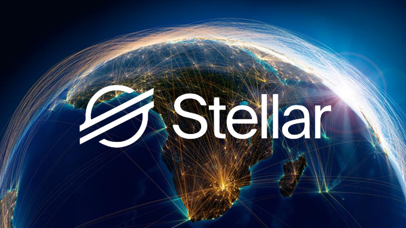

# Stellar-XLM 
Stellar is an open network for storing and moving money.

-------------------------------------------------------

## Borderless. Limitless. Powerful.
Stellar makes it possible to create, send, and trade digital representations of all forms of money: dollars, pesos, bitcoin, pretty much anything. It’s designed so all the world’s financial systems can work together on a single network.

-------------------------------------------------------

## Stellar makes money better.
Stellar's API and SDKs are ready to help you transform the world of finance, and the network’s currency connections could give even a small company the power and reach of an international bank. Here's what you can build with a few lines of code:

* Global Payment Apps
* Asset exchanges
* Micropayment services

